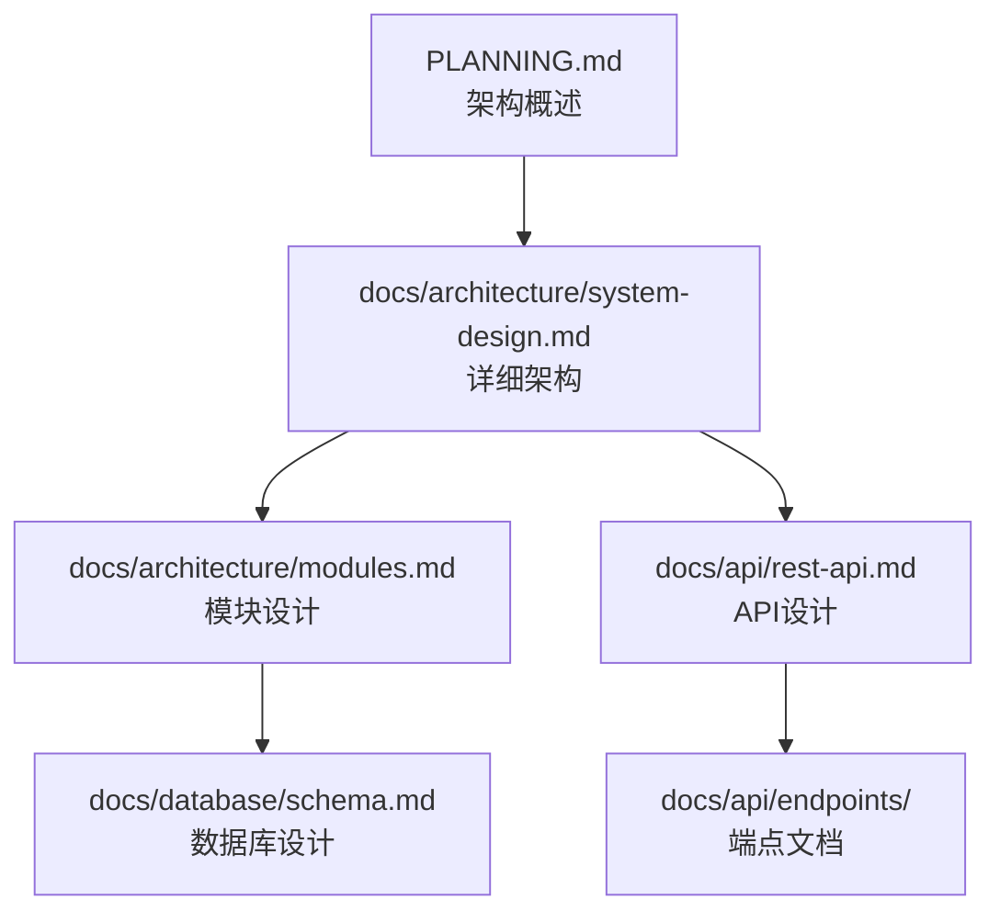
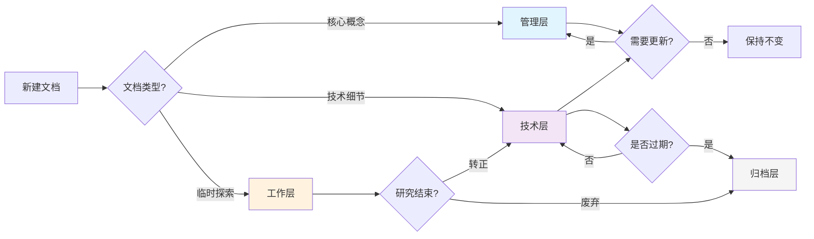

# 文档架构最佳实践

> 📚 项目文档的层次化管理规范 - 面向用户和AI的上下文优化方案

---

## 🎯 设计目标

1. **面向双重读者**: 用户（人类开发者）& AI（Claude Code）
2. **上下文成本可控**: AI加载文档时Token消耗最小化
3. **层次清晰**: 按重要性和使用频率分层组织
4. **按需加载**: 通过索引机制实现智能文档引用
5. **易于维护**: 定期整理、重构机制防止文档膨胀

---

## 📁 四层文档架构

### 架构概览

```
项目根目录/
├── 📋 管理层（5个核心文档，prime自动加载）
│   ├── PRD.md              # 项目需求文档（只读）
│   ├── PLANNING.md         # 技术架构和开发标准
│   ├── TASK.md             # 任务追踪和进度管理
│   ├── CONTEXT.md          # 会话上下文（自动管理）
│   └── KNOWLEDGE.md        # 知识库 + 📚文档索引中心
│
├── 📁 技术层（按需加载，通过KNOWLEDGE.md索引）
│   └── docs/
│       ├── architecture/   # 架构设计文档
│       │   ├── system-design.md
│       │   ├── modules.md
│       │   └── data-flow.md
│       │
│       ├── api/            # API文档
│       │   ├── rest-api.md
│       │   ├── authentication.md
│       │   └── endpoints/
│       │
│       ├── database/       # 数据库设计
│       │   ├── schema.md
│       │   ├── migrations.md
│       │   └── optimization.md
│       │
│       └── deployment/     # 部署文档
│           ├── deployment-guide.md
│           ├── ci-cd.md
│           └── monitoring.md
│
├── 📁 工作层（临时文档，不加载到AI上下文）
│   └── docs/research/
│       ├── spikes/         # 技术探索（Spike）
│       │   └── 2024-10-auth-options.md
│       │
│       └── prototypes/     # 原型研究
│           └── 2024-10-ui-mockup.md
│
└── 📁 归档层（历史文档，不加载）
    └── docs/archive/
        ├── 2024-Q1/        # 按季度归档
        │   └── old-architecture.md
        │
        └── deprecated/     # 废弃的设计方案
            └── removed-feature.md
```

---

## 📊 各层详细说明

### 第一层：管理层（Management Layer）

**定位**: 项目的核心控制中心，AI会话的必加载文档

**文件列表**:

| 文件 | 职责 | 维护频率 | AI权限 |
|------|------|---------|--------|
| **PRD.md** | 项目需求和规范 | 低（产品主导） | 只读 |
| **PLANNING.md** | 技术架构和标准 | 中（重大决策时） | 读写 |
| **TASK.md** | 任务追踪 | 高（实时更新） | 读写 |
| **CONTEXT.md** | 会话上下文 | 自动（commit时） | 只读（AI）<br/>写入（/wf_11_commit） |
| **KNOWLEDGE.md** | 知识库+文档索引 | 中（新模式时） | 读写 |

**加载策略**: `/wf_03_prime` **始终全部加载**（成本可控，5个文件）

**原则**:
- ✅ 保持简洁，只存放核心概念
- ✅ 技术细节外放到技术层
- ✅ KNOWLEDGE.md维护文档索引
- ❌ 避免长篇大论，控制在合理大小

---

### 第二层：技术层（Technical Layer）

**定位**: 详细的技术文档，通过索引按需引用

**组织原则**:

1. **按主题分类**: architecture, api, database, deployment等
2. **模块化**: 每个文档聚焦单一主题
3. **索引驱动**: 在KNOWLEDGE.md中建立索引
4. **关联明确**: 说明文档间的依赖关系

**目录结构示例**:

```
docs/
├── architecture/           # 架构设计
│   ├── README.md          # 架构文档导航
│   ├── system-design.md   # 系统整体设计
│   ├── modules.md         # 模块划分
│   ├── data-flow.md       # 数据流设计
│   └── decisions/         # ADR (Architecture Decision Records)
│       ├── 001-database-choice.md
│       └── 002-auth-strategy.md
│
├── api/                   # API文档
│   ├── README.md
│   ├── rest-api.md        # RESTful API规范
│   ├── authentication.md  # 认证机制
│   ├── authorization.md   # 授权机制
│   └── endpoints/         # 端点详细文档
│       ├── users.md
│       └── products.md
│
├── database/              # 数据库文档
│   ├── README.md
│   ├── schema.md          # 数据库模式
│   ├── migrations.md      # 迁移策略
│   ├── optimization.md    # 性能优化
│   └── backup.md          # 备份恢复
│
└── deployment/            # 部署文档
    ├── README.md
    ├── deployment-guide.md
    ├── ci-cd.md
    ├── monitoring.md
    └── troubleshooting.md
```

**加载策略**: **按需加载**
- AI通过KNOWLEDGE.md索引了解文档存在
- 根据任务上下文判断是否需要读取
- 优先级标记（高/中/低）指导加载决策

---

### 第三层：工作层（Working Layer）

**定位**: 临时性的探索和研究文档

**适用场景**:
- 技术可行性探索（Spike）
- 原型设计和验证
- 临时性的研究笔记
- 未确定的设计方案

**组织原则**:
- 📅 文件名包含日期前缀（如 `2024-10-feature-name.md`）
- 🏷️ 明确标记为"临时"或"探索"
- 🔄 定期审查，确定是否转化为正式文档
- 🗑️ 过期后移到归档层

**示例**:
```
docs/research/
├── spikes/
│   ├── 2024-10-15-redis-vs-memcached.md
│   ├── 2024-10-20-oauth2-implementation.md
│   └── 2024-10-25-graphql-migration.md
│
└── prototypes/
    ├── 2024-10-10-new-ui-layout.md
    └── 2024-10-18-payment-integration.md
```

**加载策略**: **不加载到AI上下文**
- AI不主动读取此层文档
- 用户可手动指示AI读取特定文件
- 用于记录思考过程，不作为权威参考

---

### 第四层：归档层（Archive Layer）

**定位**: 历史文档和废弃设计的长期存储

**适用场景**:
- 过期的技术文档（已被新版本取代）
- 废弃的功能设计
- 历史性的决策记录（仅供参考）
- 季度性归档（如旧的sprint计划）

**组织原则**:
- 📅 按时间组织（如按季度：2024-Q1, 2024-Q2）
- 🏷️ 明确标记归档原因
- 📎 保留链接关系，说明被什么文档取代
- 🔒 只读，不再更新

**示例**:
```
docs/archive/
├── 2024-Q1/
│   ├── old-architecture.md
│   └── deprecated-api-v1.md
│
├── 2024-Q2/
│   └── removed-feature-design.md
│
└── deprecated/
    ├── monolith-design.md       # 被微服务架构取代
    └── session-auth.md          # 被JWT取代
```

**加载策略**: **永不加载**
- 仅供人类查阅历史
- AI不访问此层（除非用户明确指示）

---

## 🔗 文档关联机制

### KNOWLEDGE.md作为文档索引中心

在KNOWLEDGE.md中维护"文档地图"章节：

```markdown
## 📚 文档索引

### 技术文档地图

| 主题 | 文档路径 | 说明 | 优先级 | 最后更新 |
|------|---------|------|--------|---------|
| 系统架构 | docs/architecture/system-design.md | 核心架构设计 | 高 | 2024-10-31 |
| 模块划分 | docs/architecture/modules.md | 模块边界和职责 | 高 | 2024-10-25 |
| REST API | docs/api/rest-api.md | API规范和约定 | 中 | 2024-10-28 |
| 认证机制 | docs/api/authentication.md | JWT认证实现 | 高 | 2024-10-30 |
| 数据库模式 | docs/database/schema.md | 完整数据库设计 | 中 | 2024-10-20 |
| 部署指南 | docs/deployment/deployment-guide.md | 生产部署流程 | 中 | 2024-10-15 |

### 文档关联关系（任务-文档映射）

| 任务类型 | 相关文档 | 说明 |
|---------|---------|------|
| **实现用户认证** | architecture/system-design.md<br/>api/authentication.md | 理解系统架构和认证设计 |
| **添加新API端点** | api/rest-api.md<br/>api/endpoints/ | 遵循API规范 |
| **数据库优化** | database/schema.md<br/>database/optimization.md | 理解数据模型和优化策略 |
| **部署新版本** | deployment/deployment-guide.md<br/>deployment/ci-cd.md | 遵循部署流程 |

### 文档依赖关系


```

**AI使用方式**:
1. `/wf_03_prime` 加载KNOWLEDGE.md，理解文档地图
2. 根据当前任务（从TASK.md获取），查询关联文档
3. 按优先级和相关性决定是否读取技术层文档
4. 在工作过程中，AI可提示用户："建议参考 docs/api/authentication.md"

---

## 🧠 AI按需加载策略

### 加载决策树

```
AI接收到任务
    ↓
1. prime阶段：读取5个管理层文档
    ↓
2. 从KNOWLEDGE.md解析文档索引
    ↓
3. 根据TASK.md当前任务分析相关性
    ↓
4. 判断是否需要加载技术文档：
    ├─ 优先级=高 且 任务相关 → 立即加载
    ├─ 优先级=中 且 任务相关 → 询问用户或按需加载
    ├─ 优先级=低 → 仅记录存在，不加载
    └─ 任务无关 → 不加载
    ↓
5. 工作过程中，根据需要读取额外文档
```

### 示例场景

**场景1: 实现用户登录功能**

```
1. /wf_03_prime 加载：
   ✓ PRD.md, PLANNING.md, TASK.md, CONTEXT.md, KNOWLEDGE.md

2. 从KNOWLEDGE.md识别相关文档：
   - docs/architecture/system-design.md (优先级:高)
   - docs/api/authentication.md (优先级:高)

3. AI判断：任务是"实现登录"，高度相关 → 立即加载这2个文档

4. 工作中发现需要理解数据库：
   - 读取 docs/database/schema.md (用户表结构)
```

**场景2: 修复性能Bug**

```
1. /wf_03_prime 加载：
   ✓ 5个管理层文档

2. 从KNOWLEDGE.md识别相关文档：
   - docs/database/optimization.md (优先级:中)
   - docs/architecture/data-flow.md (优先级:高)

3. AI判断：性能问题相关 → 加载这2个文档

4. 调试中发现API慢：
   - 读取 docs/api/endpoints/users.md
```

---

## 🔄 文档维护流程

### 定期维护（/wf_13_doc_maintain）

**执行时机**:
- 每10次提交后提示运行
- 季度末（Q1/Q2/Q3/Q4结束时）
- 发现文档混乱时

**维护内容**:

#### 1. 结构审查
```
✓ 检查文档是否在正确的层级
✓ 识别放错位置的文档
✓ 验证命名规范
```

#### 2. 内容分析
```
✓ 识别过期内容（超过6个月未更新且无引用）
✓ 检测重复内容（相似度>80%）
✓ 发现孤立文档（无索引、无链接）
```

#### 3. 索引更新
```
✓ 更新KNOWLEDGE.md文档地图
✓ 更新各层README.md导航
✓ 检查链接有效性
```

#### 4. 归档决策
```
候选归档条件：
- 6个月以上未更新
- 相关功能已废弃
- 被新文档完全取代
- 标记为"临时"的工作层文档
```

### 文档生命周期



---

## 📏 文档编写规范

### 通用规范

1. **文件命名**:
   - 使用小写字母和连字符: `user-authentication.md`
   - 临时文档加日期前缀: `2024-10-31-spike-redis.md`
   - README.md作为目录导航

2. **文档结构**:
   ```markdown
   # 文档标题

   > 一句话描述文档用途

   **最后更新**: 2024-10-31
   **维护者**: 团队/个人
   **相关文档**: [链接到相关文档]

   ---

   ## 概述
   （文档主要内容）

   ## 详细说明
   （技术细节）

   ## 参考资料
   （外部链接和资源）
   ```

3. **链接规范**:
   - 使用相对路径: `[架构设计](../architecture/system-design.md)`
   - 在KNOWLEDGE.md中建立索引
   - 双向链接（A引用B，B也应提及A）

4. **元数据管理**:
   ```markdown
   ---
   title: "用户认证设计"
   category: "API"
   priority: "高"
   last_updated: "2024-10-31"
   related_tasks: ["TASK-123", "TASK-456"]
   ---
   ```

### 各层特定规范

#### 管理层文档
- ✅ 保持简洁，控制在500行以内
- ✅ 只放核心概念和关键决策
- ✅ 技术细节用链接引用技术层
- ❌ 避免长代码示例（放到技术层）

#### 技术层文档
- ✅ 详细但聚焦单一主题
- ✅ 包含代码示例和图表
- ✅ 提供实际使用案例
- ✅ 在KNOWLEDGE.md中建立索引

#### 工作层文档
- ✅ 文件名包含日期
- ✅ 明确标记状态（进行中/已完成/已废弃）
- ✅ 记录探索过程和结论
- ✅ 定期审查，决定去向（转正/归档）

#### 归档层文档
- ✅ 保留元数据（归档原因、日期）
- ✅ 说明被什么文档取代
- ✅ 不再更新，只读
- ✅ 按季度组织

---

## 💡 最佳实践

### ✅ 推荐做法

1. **保持管理层轻量**:
   - PLANNING.md只放架构概述，详细设计放docs/architecture/
   - KNOWLEDGE.md维护索引，不复制内容

2. **建立清晰的索引**:
   - 在KNOWLEDGE.md维护文档地图
   - 每个技术目录都有README.md导航

3. **标记优先级**:
   - 高优先级: 核心架构、关键API
   - 中优先级: 一般功能文档
   - 低优先级: 辅助工具、历史参考

4. **定期维护**:
   - 季度末运行 /wf_13_doc_maintain
   - 完成大功能后更新文档索引
   - 发现过期内容及时归档

5. **双向关联**:
   - TASK.md任务关联技术文档
   - 技术文档在KNOWLEDGE.md中索引
   - 文档间相互引用

### ❌ 避免的陷阱

1. **文档过度扁平化**:
   - ❌ 所有文档都放根目录
   - ✅ 按四层架构组织

2. **缺乏索引**:
   - ❌ 文档很多但无导航
   - ✅ KNOWLEDGE.md维护文档地图

3. **过早归档**:
   - ❌ 仍在使用的文档被归档
   - ✅ 确认无引用后再归档

4. **重复内容**:
   - ❌ 同样信息在多个文档中
   - ✅ 单一来源，其他处链接引用

5. **忽略维护**:
   - ❌ 文档只增不减
   - ✅ 定期运行 /wf_13_doc_maintain

---

## 📊 成功指标

良好的文档架构应该达到：

1. **AI上下文效率**:
   - `/wf_03_prime` 加载时间 < 5秒
   - 管理层文档总大小 < 100KB
   - 80%的任务只需加载0-2个技术文档

2. **文档可维护性**:
   - 每个文档有明确的Owner
   - 90%的文档在6个月内更新过
   - 重复内容 < 5%

3. **用户体验**:
   - 用户能在3次点击内找到需要的信息
   - 新成员通过README能快速理解项目
   - 文档和代码同步更新

4. **AI辅助效果**:
   - AI能准确识别相关文档
   - AI建议的文档准确率 > 80%
   - 减少重复提问（知识复用）

---

## 🔗 工作流集成

### 命令与文档的关系

| 命令 | 文档操作 |
|------|---------|
| `/wf_01_planning` | 创建PLANNING.md，初始化文档架构章节 |
| `/wf_03_prime` | 加载5个管理层文档 + 智能加载技术文档 |
| `/wf_04_ask` | 参考KNOWLEDGE.md索引，建议相关文档 |
| `/wf_05_code` | 根据PLANNING.md和技术文档实现代码 |
| `/wf_06_debug` | 查阅KNOWLEDGE.md已知问题，记录新方案 |
| `/wf_11_commit` | 更新CONTEXT.md，可能更新KNOWLEDGE.md索引 |
| `/wf_13_doc_maintain` | 维护文档结构，更新索引，执行归档 |

---

## 📚 参考资源

- [C4 Model](https://c4model.com/) - 软件架构可视化
- [ADR (Architecture Decision Records)](https://adr.github.io/) - 架构决策记录
- [Documentation Guide](https://www.writethedocs.org/) - 文档编写指南
- [Diátaxis Framework](https://diataxis.fr/) - 文档类型划分

---

**最后更新**: 2024-10-31
**版本**: v1.0
**维护**: Workflow Commands Team

该架构确保文档层次清晰、关联明确、上下文成本可控，同时支持AI和人类高效协作。
