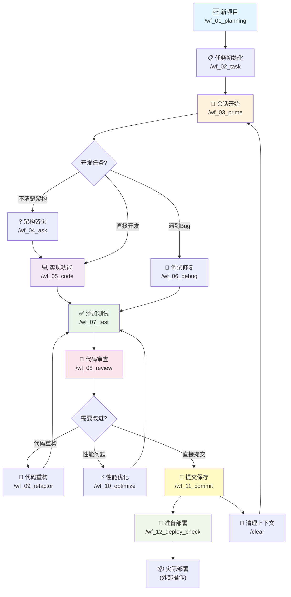
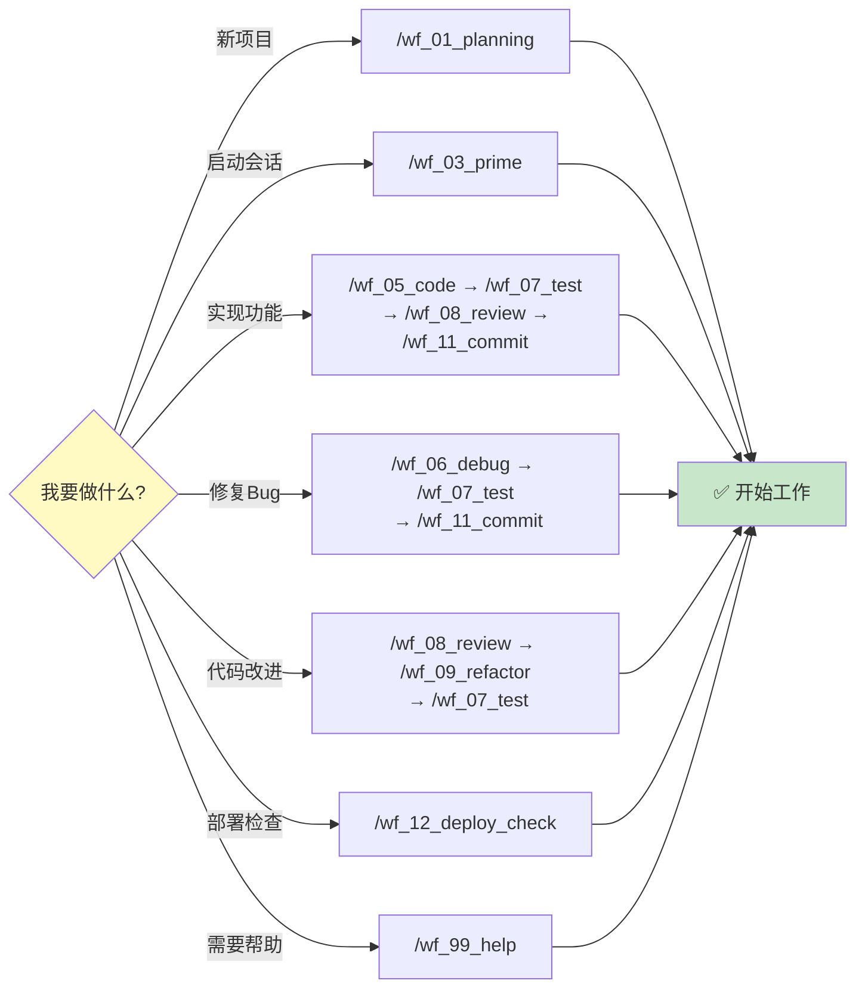

# 工作流场景指导

> 🔄 常见开发场景的命令组合和最佳实践

---

## 📑 目录

- [核心工作流](#核心工作流)
- [完整开发流程](#完整开发流程)
- [常见场景](#常见场景)
- [工作流决策树](#工作流决策树)
- [最佳实践](#最佳实践)

---

## 核心工作流

### 🆕 全新项目开始

```bash
# 1. 创建项目规划
/wf_01_planning "项目名称"

# 2. 生成任务列表
/wf_02_task create

# 3. 加载项目上下文
/wf_03_prime
```

**预计时间**: 15-30分钟
**输出**: PLANNING.md + TASK.md
**下一步**: 开始功能开发

---

### 📱 会话管理生命周期

```bash
# 会话开始
/wf_03_prime              # 加载所有项目上下文

# 进行工作
/wf_05_code "功能"        # 开发
/wf_07_test "模块"        # 测试
/wf_11_commit            # 提交

# 上下文过大时
/clear                   # 清理上下文
/wf_03_prime             # 重新加载，无缝继续
```

**关键点**:
- 始终以 `/wf_03_prime` 开始会话
- 定期用 `/wf_11_commit` 保存进度（自动更新CONTEXT.md）
- `/clear` 后必须运行 `/wf_03_prime` 恢复上下文

---

## 完整开发流程

### ✨ 功能开发（标准流程）

```bash
# 0. 可选：架构咨询（复杂功能必做）
/wf_04_ask "如何实现用户认证功能？"

# 1. 代码实现
/wf_05_code "实现JWT用户认证"
  ↓ [系统提示下一步]

# 2. 编写测试（验证功能）
/wf_07_test "authentication module"
  ↓ [系统提示下一步]

# 3. 代码审查（质量把控）
/wf_08_review
  ↓ [系统提示下一步]

# 4. 可选：重构改进（如审查有建议）
/wf_09_refactor "改进XX模块"
  ↓ [系统提示下一步]

# 5. 可选：生成/更新文档
/wf_14_doc  # 交互式选择要生成的文档

# 6. 提交代码（自动格式化+上下文更新）
/wf_11_commit "feat: add JWT authentication"
  ↓ [系统提示下一步]

# 7. 可选：更新任务状态
/wf_02_task update
```

**预计时间**: 中等功能 30-60分钟

**关键检查点**:
- [ ] PLANNING.md标准遵守
- [ ] PRD需求满足
- [ ] 测试覆盖率达标 (> 90%)
- [ ] 代码审查通过
- [ ] 重构改进（如需要）
- [ ] 文档已更新（可选）

**系统衔接**:
- 每个命令完成后，系统会自动提示"下一步操作"
- 建议按照系统建议的命令顺序执行
- 允许灵活跳过（如快速路径）或调整顺序（如架构咨询）

---

### 🐛 Bug修复（快速路径）

```bash
# 1. 系统化调试
/wf_06_debug "用户登录返回500错误"
  ↓ [系统提示下一步]

# 或：快速修复（简单问题）
/wf_06_debug "按钮文字错误" --quick
  ↓ [系统提示下一步]

# 2. 验证修复（推荐）
/wf_07_test "login functionality"
  ↓ [系统提示下一步]

# 3. 代码审查（可选，简单修复可跳过）
/wf_08_review
  ↓ [系统提示下一步]

# 4. 提交修复
/wf_11_commit "fix: resolve login 500 error"
```

**预计时间**:
- 简单Bug: 5-15分钟 (直接 /wf_06_debug → /wf_11_commit)
- 复杂Bug: 30-90分钟 (需要完整流程)

**调试技巧**:
- 使用 `/wf_06_debug` 的系统化分析
- 查阅 KNOWLEDGE.md 已知问题，快速定位相似问题
- 记录新解决方案到 KNOWLEDGE.md，便于后续参考
- 简单bug可用 `--quick` 快速处理

**快速路径 vs 标准流程**:
- 简单修复（如文字/配置错误）: `/wf_06_debug --quick` → `/wf_11_commit`
- 复杂修复（如业务逻辑bug）: `/wf_06_debug` → `/wf_07_test` → `/wf_08_review` → `/wf_11_commit`

---

### 📊 代码质量改进

```bash
# 1. 质量分析（识别问题和改进机会）
/wf_08_review
  ↓ [系统提示下一步]

# 2. 代码重构（改进结构）
/wf_09_refactor "user service"
  ↓ [系统提示下一步]

# 3. 性能优化（如需要）
/wf_10_optimize "API response time"
  ↓ [系统提示下一步]

# 4. 回归测试（确保功能无破坏）
/wf_07_test --coverage
  ↓ [系统提示下一步]

# 5. 二次审查（确认改进）
/wf_08_review
  ↓ [系统提示下一步]

# 6. 提交改进
/wf_11_commit "refactor: improve code quality"
```

**预计时间**: 45-120分钟

**关键原则**:
- ✅ 保持功能完全不变（100%回归测试通过）
- ✅ 测试覆盖率 > 90%
- ✅ 对齐PLANNING.md架构
- ✅ 二次审查确保改进有效

**流程说明**:
- 审查识别问题 → 重构改进 → 测试验证 → 再次审查 → 提交
- 性能优化是可选的，如不需要则跳过 /wf_10_optimize
- 重构后必须通过完整测试，确保无破坏

---

### 📦 部署准备

```bash
# 1. 测试覆盖率检查
/wf_07_test --coverage

# 2. 最终代码审查
/wf_08_review

# 3. 部署就绪检查
/wf_12_deploy_check "production"

# 4. 实际部署（根据项目配置）
# 例如: npm run deploy, docker push, etc.
```

**部署清单**:
- [ ] 所有测试通过
- [ ] 代码审查完成
- [ ] PRD需求验证
- [ ] 安全检查通过
- [ ] 性能指标达标

---

### 📚 文档维护流程 (NEW)

```bash
# 1. 定期执行（每10次提交或季度末）
/wf_13_doc_maintain

# 2. 查看维护报告
# - 结构合规性
# - 过期/重复/孤立文档
# - 索引准确性

# 3. 自动修复（可选）
/wf_13_doc_maintain --auto

# 4. 预览模式（不做修改）
/wf_13_doc_maintain --dry-run

# 5. 重新加载优化后的上下文
/wf_03_prime
```

**维护时机**:
- 每10次提交后
- 季度末（Q1/Q2/Q3/Q4）
- 发现文档混乱时
- 管理层文档 > 100KB时

**预计时间**: 5-15分钟

---

## 常见场景

### 场景1：添加新功能

**步骤**:
```
/wf_04_ask "技术方案咨询"
  ↓
/wf_05_code "功能实现"
  ↓
/wf_07_test "测试覆盖"
  ↓
/wf_08_review "质量检查"
  ↓
/wf_11_commit "提交保存"
```

### 场景2：修复紧急Bug

**快速路径**:
```
/wf_06_debug "错误描述" --quick
  ↓
/wf_07_test "验证修复"
  ↓
/wf_11_commit "紧急修复"
```

### 场景3：代码重构

**谨慎路径**:
```
/wf_08_review "识别问题"
  ↓
/wf_09_refactor "重构实施"
  ↓
/wf_07_test --coverage "回归测试"
  ↓
/wf_08_review "二次验证"
  ↓
/wf_11_commit "重构完成"
```

### 场景4：架构咨询后的深度代码审查

**深度分析路径**:
```
/wf_04_ask "架构问题" --review-codebase
  ↓ [系统生成TASK.md改进任务]
  ↓
查看生成的TASK.md改进建议
  ↓
逐个处理高优先级任务:
  - 简单修复: /wf_06_debug
  - 重构改进: /wf_09_refactor
  - 功能完善: /wf_05_code
  ↓
/wf_07_test --coverage
  ↓
/wf_08_review (二次审查)
  ↓
/wf_11_commit
```

**说明**: --review-codebase 会自动生成改进任务，建议按优先级逐个处理。

---

### 场景4.5: 合并多个commit

**使用场景**: 想要整理git历史，合并相关的多个commit为一个

**快速方案**:
```bash
# 方案 A: 使用 /wf_11_commit 的 --squash 参数
/wf_11_commit --squash 3 "feat: 完整的功能实现"

# 结果: 最后3个commit合并为1个，自动更新CONTEXT.md

# 方案 B: 直接用git命令（如需更复杂的操作）
git rebase -i HEAD~3        # 交互式变基
# 编辑提交信息，合并commit
git push --force-with-lease # 推送（谨慎使用--force）
```

**特点**:
- `/wf_11_commit --squash` 更便捷，会自动更新CONTEXT.md
- 原生git命令更灵活，但需要手动管理
- 建议日常使用 /wf_11_commit --squash
- 复杂变基场景才用 git rebase -i

---

### 场景5：智能文档生成 ⭐ NEW

**文档生成路径** (功能完成后):
```bash
# 完成功能开发
/wf_05_code "实现用户认证"
  ↓
/wf_08_review "代码审查"
  ↓
# 生成/更新文档
/wf_14_doc
  ↓
AI分析代码库并展示:
  - 📊 项目技术栈分析
  - 📋 文档缺口报告（3个新API端点缺文档）
  - 💡 建议生成的文档列表
  ↓
选择要生成的文档:
  [1] API 文档更新
  [2] 环境变量文档
  [3] README 更新
  ↓
AI从代码提取信息并生成文档
  ↓
审查生成的文档，完善细节
  ↓
/wf_13_doc_maintain  # 检查文档结构
  ↓
/wf_11_commit "docs: update API documentation"
```

**快速更新特定文档**:
```bash
# 只更新API文档
/wf_14_doc --update api

# 只检查不生成（CI/CD）
/wf_14_doc --check
```

**核心理念**: "提取而非编造" - 文档从代码中自动提取真实信息

---

### 场景6：文档维护和优化

**定期维护路径**:
```bash
/wf_13_doc_maintain
  ↓
审查维护报告:
  - 文档结构合规性
  - 过期文档识别
  - 重复内容检测
  - 索引准确性
  ↓
确认自动修复或手动处理
  ↓
/wf_03_prime  # 重新加载优化后的上下文
```
**详细流程**: 查看 [DOC_ARCHITECTURE.md](DOC_ARCHITECTURE.md#文档维护流程)

---

## 工作流决策树

### 我应该用哪个命令？

```
📍 当前状态？
│
├─ 🆕 全新开始
│  ├─ 新项目启动 → /wf_01_planning
│  └─ 新会话开始 → /wf_03_prime
│
├─ 💻 开发阶段
│  ├─ 不确定如何实现 → /wf_04_ask
│  ├─ 开始写代码 → /wf_05_code
│  ├─ 遇到Bug → /wf_06_debug
│  └─ 添加测试 → /wf_07_test
│
├─ 🔍 质量改进
│  ├─ 检查代码质量 → /wf_08_review
│  ├─ 需要重构 → /wf_09_refactor
│  └─ 性能问题 → /wf_10_optimize
│
├─ 💾 完成工作
│  ├─ 更新任务状态 → /wf_02_task update
│  ├─ 提交代码 → /wf_11_commit
│  └─ 准备部署 → /wf_12_deploy_check
│
└─ ❓ 需要帮助 → /wf_99_help
```

### 命令依赖关系

```
典型依赖链：

必须顺序：
/wf_01_planning → /wf_02_task → /wf_03_prime

推荐顺序：
/wf_05_code → /wf_07_test → /wf_08_review → /wf_11_commit

可选分支：
/wf_08_review → /wf_09_refactor → /wf_07_test (回归)
/wf_08_review → /wf_10_optimize → /wf_07_test (验证)
```

### 完整Workflow流程图



### 常见场景的快速决策流



---

## 最佳实践

### 会话管理

✅ **永远先 `/wf_03_prime`**
- 每个新会话的第一个动作
- `/clear` 后立即运行
- 确保AI理解项目上下文
- 智能加载技术文档（NEW）

✅ **经常 `/wf_11_commit`**
- 完成一个逻辑功能就提交
- 自动更新CONTEXT.md
- 支持跨会话连续性

✅ **及时 `/wf_02_task update`**
- 完成任务后立即更新
- 保持进度可见
- 便于团队协作

✅ **定期 `/wf_13_doc_maintain`** (NEW)
- 每10次提交后运行
- 季度末执行维护
- 保持管理层 < 100KB
- 确保文档索引准确

---

### 开发质量

✅ **测试先行**
- 实现功能后立即 `/wf_07_test`
- 使用 `--coverage` 检查覆盖率
- 回归测试防止破坏

✅ **审查驱动**
- 提交前必须 `/wf_08_review`
- 识别问题早期修复
- 维护代码质量

✅ **架构咨询**
- 复杂功能先 `/wf_04_ask`
- 使用 `--review-codebase` 深度分析
- 记录决策到PLANNING.md

---

### 上下文优化

✅ **按需清理**
- Token接近上限时 `/clear`
- 清理后立即 `/wf_03_prime`
- CONTEXT.md保证连续性

✅ **文档维护** (ENHANCED)
- PLANNING.md：重大决策更新，核心概念保持简洁
- KNOWLEDGE.md：新模式记录 + 📚维护文档索引（NEW）
- TASK.md：实时进度追踪
- **技术细节外放到 docs/**（NEW）: 保持管理层轻量
- **定期运行 /wf_13_doc_maintain**（NEW）: 清理过期文档

✅ **智能文档管理** (NEW)
- 创建技术文档必须在KNOWLEDGE.md中建立索引
- 标记文档优先级（高/中/低）
- 建立任务-文档关联关系
- 工作层文档（docs/research/）添加日期前缀
- 过期文档及时归档到docs/archive/

---

### PRD对齐

✅ **需求追溯**
- 每个任务关联PRD需求
- 决策验证PRD约束
- 提交时检查PRD合规

✅ **质量门控**
- PRD.md永远只读
- PLANNING.md对齐PRD
- 代码满足PRD标准

---

## 🎯 快速参考

### 核心工作流（记住这5个）

1. **项目启动**:
   - `/wf_01_planning "项目名称"` → `/wf_02_task create` → `/wf_03_prime`

2. **功能开发** (标准):
   - `/wf_05_code "功能描述"` → `/wf_07_test` → `/wf_08_review` → `/wf_11_commit`

3. **Bug修复** (快速):
   - `/wf_06_debug "问题描述"` → `/wf_07_test` → `/wf_11_commit`
   - 简单Bug: `/wf_06_debug --quick` → `/wf_11_commit`

4. **质量改进** (完整):
   - `/wf_08_review` → `/wf_09_refactor` → `/wf_07_test` → `/wf_08_review` → `/wf_11_commit`

5. **会话管理** (连续性):
   - 开始: `/wf_03_prime` (加载上下文)
   - 保存: `/wf_11_commit` (提交+更新CONTEXT.md)
   - 清理: `/clear` + `/wf_03_prime` (无缝恢复)

### 一句话场景决策

| 我要做什么 | 用什么命令 | 备注 |
|----------|----------|------|
| 新项目 | `/wf_01_planning` | 必须先执行 |
| 实现功能 | `/wf_05_code` | 然后 test → review → commit |
| 修复bug | `/wf_06_debug` | 简单用 --quick |
| 架构咨询 | `/wf_04_ask` | 复杂功能必做 |
| 代码审查 | `/wf_08_review` | 提交前必做 |
| 测试验证 | `/wf_07_test` | 功能/bug修复后必做 |
| 重构改进 | `/wf_09_refactor` | 审查后执行 |
| 性能优化 | `/wf_10_optimize` | 基于架构咨询 |
| 提交代码 | `/wf_11_commit` | 所有工作后执行 |
| 快速任务 | `/wf_02_task quick "描述"` | 临时任务记录 |
| 合并commit | `/wf_11_commit --squash 3 "消息"` | 整理git历史 |
| 更新任务 | `/wf_02_task update` | 任何时候都可以 |
| 加载上下文 | `/wf_03_prime` | 会话开始必做 |

### 关键原则

- 🔄 **上下文连续性**: prime(开始) → work → commit(保存) → clear → prime(恢复)
- ✅ **质量第一**: code → test → review → refactor(if needed) → commit
- 📋 **及时更新**: 完成工作就提交，及时更新TASK.md状态
- 🎯 **PRD对齐**: 所有决策都要验证PRD需求
- 📚 **知识积累**: 新决策记录到KNOWLEDGE.md，新问题记录到TASK.md

### 完成后的下一步

**系统会在每个命令完成后自动提示 "📋 下一步操作"**，建议：
- 👉 按系统建议的顺序执行
- 👉 允许跳过非必要步骤（如审查简单bug）
- 👉 可以调整顺序（如先架构咨询再编码）

**记住一个核心流**: 代码 → 测试 → 审查 → 提交

---

**最后更新**: 2025-11-21
**版本**: v3.3 (新增智能文档生成 + MCP 集成)

**相关文档**:
- [命令完整参考](COMMANDS.md)
- [故障排查指南](TROUBLESHOOTING.md)
- [AI执行规则](CLAUDE.md)
- [文档架构最佳实践](DOC_ARCHITECTURE.md) (NEW)
