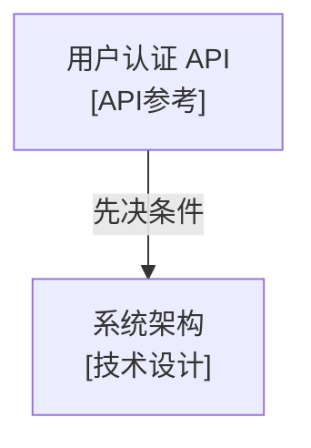

# Frontmatter元数据规范参考

本文档定义了项目技术文档的Frontmatter元数据标准，作为**单一真实来源（SSOT）**。

> **适用范围**: 所有 `docs/` 目录下的技术文档（.md文件）

---

## 📋 标准模板

所有技术文档应在文件顶部包含以下 Frontmatter 结构：

```yaml
---
# 基础信息（必需）
title: "文档标题"
description: "一句话描述文档的核心内容"
type: "技术设计 | 系统集成 | API参考 | 教程 | 故障排查 | 架构决策"
status: "完成 | 草稿 | 待审查"

# 优先级和更新（必需）
priority: "高 | 中 | 低"
created_date: "2025-11-10"         # 创建日期，一旦设置永不修改
last_updated: "2025-11-10"         # 最后更新日期，每次修改自动更新

# 关系网络（推荐，至少设置一个）
related_documents:
  - path: "docs/architecture/system-design.md"
    type: "交叉参考 | 扩展阅读 | 先决条件"
    description: "简要说明关系"

related_code:
  - path: "src/services/auth.py"
    type: "实现 | 参考 | 测试 | 使用"
    line_range: "150-200"          # 可选
    description: "简要说明代码部分"

# 元数据（可选）
tags: ["API", "认证", "JWT"]
authors: ["Claude", "Team Member"]
version: "1.0"

# 文档维护（可选但推荐）
next_review_date: "2025-05-10"     # 计划下次审查日期
related_tasks:
  - "实现用户认证系统"             # TASK.md中对应任务
---
```

---

## 📖 字段说明

### 必需字段（7个）

| 字段 | 说明 | 示例 | 格式要求 |
|------|------|------|---------|
| **title** | 文档标题，应与markdown H1一致 | "用户认证API文档" | 字符串 |
| **description** | 单句概述，用于文档列表展示 | "定义JWT认证流程和API端点" | 字符串，<150字符 |
| **type** | 文档分类，帮助快速定位 | "API参考" | 见枚举值↓ |
| **status** | 完成度，控制是否对外展示 | "完成" | 见枚举值↓ |
| **priority** | 优先级，用于优化加载顺序 | "高" | 见枚举值↓ |
| **created_date** | 初创日期（永不修改） | "2025-11-10" | YYYY-MM-DD |
| **last_updated** | 最后更新日期（自动更新） | "2025-11-10" | YYYY-MM-DD |

### 推荐字段（2个）

| 字段 | 说明 | 示例 | 格式要求 |
|------|------|------|---------|
| **related_documents** | 指向相关文档，建立文档网络 | 见类型分类↓ | 数组，每项包含path/type/description |
| **related_code** | 指向实现代码，链接文档与代码 | 见类型分类↓ | 数组，每项包含path/type/description |

### 可选字段（4个）

| 字段 | 说明 | 示例 | 格式要求 |
|------|------|------|---------|
| **tags** | 用于搜索和分类 | ["API", "认证"] | 字符串数组 |
| **authors** | 文档作者 | ["Claude", "John"] | 字符串数组 |
| **version** | 文档版本 | "1.0" | 字符串 |
| **next_review_date** | 计划审查日期 | "2025-05-10" | YYYY-MM-DD |
| **related_tasks** | 关联的TASK.md任务 | ["任务标题"] | 字符串数组 |

---

## 🏷️ 枚举值定义

### type（文档类型）- 6种

| 枚举值 | 适用场景 | 示例 |
|-------|---------|------|
| **技术设计** | 架构设计、系统设计文档 | `docs/architecture/system-design.md` |
| **系统集成** | 集成方案、部署配置 | `docs/deployment/kubernetes.md` |
| **API参考** | API端点定义、接口说明 | `docs/api/rest-endpoints.md` |
| **教程** | 开发指南、使用教程 | `docs/development/getting-started.md` |
| **故障排查** | 问题诊断、故障解决 | `docs/troubleshooting/common-issues.md` |
| **架构决策** | ADR记录 | `docs/adr/001-use-postgresql.md` |

### status（完成度）- 3种

| 枚举值 | 说明 | 使用场景 |
|-------|------|---------|
| **草稿** | 文档正在编写中 | 新建文档，内容未完成 |
| **待审查** | 内容完成，等待审查 | 提交审查前 |
| **完成** | 已审查，可对外使用 | 正式发布的文档 |

### priority（优先级）- 3种

| 枚举值 | 说明 | 确定依据 |
|-------|------|---------|
| **高** | 核心文档，频繁访问 | API参考、架构决策、系统集成 |
| **中** | 重要但非核心 | 教程、开发指南 |
| **低** | 辅助性文档 | 故障排查、历史文档 |

**优先级自动判定规则**：
```python
def determine_priority(doc_type, reference_count):
    """基于文档类型和引用次数确定优先级"""
    high_priority_types = ['API参考', '系统集成', '架构决策']

    if doc_type in high_priority_types:
        return '高'
    elif reference_count > 5:  # 被引用5次以上
        return '高'
    elif reference_count > 2:
        return '中'
    else:
        return '低'
```

---

## 🔗 关系类型分类

### related_documents 的 type 分类

| 类型 | 说明 | 示例 |
|------|------|------|
| **交叉参考** | 从不同角度解释同一概念 | 认证文档 ↔ OAuth文档 |
| **扩展阅读** | 深入理解的补充材料 | API概览 → API详细文档 |
| **先决条件** | 阅读当前文档前需要先读的 | 高级教程 → 基础教程 |

### related_code 的 type 分类

| 类型 | 说明 | 示例 |
|------|------|------|
| **实现** | 文档描述的代码实现部分 | API文档 → 路由定义文件 |
| **参考** | 文档提到但不是核心实现 | 架构文档 → 配置文件 |
| **测试** | 文档内容的测试代码 | API文档 → 测试文件 |
| **使用** | 调用或使用文档描述功能 | 库文档 → 使用示例 |

---

## 📜 使用规则

### 1. 创建文档时

**命令**: `/wf_05_code` or `/wf_14_doc`

**自动化操作**：
- ✅ 自动生成frontmatter框架
- ✅ 设置 `status: "草稿"`
- ✅ 设置 `created_date: $(date +%Y-%m-%d)`
- ✅ 根据文档路径推断 `type`
- ✅ 根据类型设置初始 `priority`

**手动补充**：
- 完善 `description`（从首段提取）
- 添加 `related_documents`（相关文档）
- 添加 `related_code`（实现代码）
- 添加 `tags`（搜索关键词）

---

### 2. 修改文档时

**自动化操作**：
- ✅ 自动更新 `last_updated: $(date +%Y-%m-%d)`（由 `/wf_11_commit` 执行）
- ✅ 保持 `created_date` 不变（历史日期）

**手动操作**：
- 如果改变了关系网络（added/removed related_documents），同时更新相关文档的反向引用
- 示例：如果 A 添加了 B 到 related_documents，则 B 也应添加 A

---

### 3. 发布文档时

**命令**: `/wf_11_commit`

**验证检查**：
- ✅ 验证 `status: "完成"`（发布前必须完成）
- ✅ 验证所有引用的文档和代码路径有效
  * ⚠️ **运行目录要求**: 验证脚本必须在**项目根目录**运行
  * 所有路径都是相对于项目根目录的
- ✅ 自动设置 `next_review_date` 为 created_date 后 6个月

---

### 4. 定期维护

**命令**: `/wf_13_doc_maintain`

**检查项**：
- ✅ 引用的文档/代码是否仍然存在
- ✅ 反向引用是否一致（A→B 则 B 应有 A 的反向引用）
- ✅ 过期文档是否需要更新或归档（`last_updated` > 6个月）
- ✅ `last_updated` 是否接近文件实际修改时间

---

## 🔍 验证逻辑

### 标准验证函数

```python
def validate_frontmatter(doc_path, frontmatter):
    """
    验证 frontmatter 元数据的标准函数

    ⚠️ IMPORTANT: 此函数假设从项目根目录运行

    Args:
        doc_path: 文档路径（相对于项目根目录，如 "docs/api/auth.md"）
        frontmatter: 解析后的 frontmatter 字典

    Returns:
        {
            'valid': bool,
            'errors': List[str],      # 阻塞性错误
            'warnings': List[str]     # 非阻塞性警告
        }
    """
    errors = []
    warnings = []

    # 1. 必需字段检查
    required_fields = [
        'title', 'description', 'type', 'status',
        'priority', 'created_date', 'last_updated'
    ]
    for field in required_fields:
        if field not in frontmatter:
            errors.append(f"缺少必需字段: {field}")

    # 2. 枚举值验证
    valid_types = ['技术设计', '系统集成', 'API参考', '教程', '故障排查', '架构决策']
    if frontmatter.get('type') not in valid_types:
        errors.append(f"无效的 type 值: {frontmatter.get('type')}")

    valid_statuses = ['草稿', '完成', '待审查']
    if frontmatter.get('status') not in valid_statuses:
        errors.append(f"无效的 status 值: {frontmatter.get('status')}")

    valid_priorities = ['高', '中', '低']
    if frontmatter.get('priority') not in valid_priorities:
        errors.append(f"无效的 priority 值: {frontmatter.get('priority')}")

    # 3. 日期格式验证
    import re
    date_pattern = re.compile(r'^\d{4}-\d{2}-\d{2}$')
    for date_field in ['created_date', 'last_updated', 'next_review_date']:
        if date_field in frontmatter:
            if not date_pattern.match(str(frontmatter[date_field])):
                errors.append(f"{date_field} 格式错误，应为 YYYY-MM-DD")

    # 4. 日期逻辑验证
    if 'created_date' in frontmatter and 'last_updated' in frontmatter:
        if frontmatter['created_date'] > frontmatter['last_updated']:
            errors.append("created_date 不能晚于 last_updated")

    # 5. 关系引用验证
    import os
    if 'related_documents' in frontmatter:
        for doc in frontmatter['related_documents']:
            if not os.path.exists(doc.get('path', '')):
                warnings.append(f"related_documents 引用的文档不存在: {doc.get('path')}")

    if 'related_code' in frontmatter:
        for code in frontmatter['related_code']:
            if not os.path.exists(code.get('path', '')):
                warnings.append(f"related_code 引用的代码文件不存在: {code.get('path')}")

    # 6. 任务引用验证
    if 'related_tasks' in frontmatter:
        try:
            with open('TASK.md', 'r', encoding='utf-8') as f:
                task_content = f.read()
                for task_ref in frontmatter['related_tasks']:
                    if task_ref not in task_content:
                        warnings.append(f"related_tasks 引用的任务不在 TASK.md 中: {task_ref}")
        except FileNotFoundError:
            warnings.append("无法验证 related_tasks: TASK.md 不存在")

    # 7. 推荐字段提醒
    recommended = ['related_documents', 'related_code', 'tags']
    missing_recommended = [f for f in recommended if f not in frontmatter]
    if missing_recommended:
        warnings.append(f"建议添加推荐字段: {', '.join(missing_recommended)}")

    return {
        'valid': len(errors) == 0,
        'errors': errors,
        'warnings': warnings
    }
```

---

## ⚙️ 执行上下文

### 运行目录要求

**⚠️ CRITICAL**: 所有 frontmatter 验证和操作脚本**必须从项目根目录运行**

**原因**：
- 所有文档路径（`docs/`）都是相对于项目根目录
- 所有代码路径（`src/`, `lib/`）都是相对于项目根目录
- `TASK.md`, `KNOWLEDGE.md` 都在项目根目录
- `os.path.exists()` 检查基于当前工作目录

**影响命令**：
- `/wf_14_doc` - 文档生成
- `/wf_13_doc_maintain` - 文档维护
- `/wf_11_commit` - 提交验证

**验证方法**：
```python
def ensure_project_root():
    """确保当前在项目根目录运行"""
    import os
    required_files = ['PLANNING.md', 'TASK.md', 'docs/']
    if not all(os.path.exists(f) for f in required_files):
        raise RuntimeError(
            "请从项目根目录运行此脚本。\n"
            "当前目录缺少必需文件: PLANNING.md, TASK.md, docs/"
        )
```

---

## 📊 成本分析

| 成本类型 | 评估 | 缓解策略 |
|---------|------|---------|
| **创建成本** | 低 | `/wf_14_doc` 自动生成框架 |
| **修改成本** | 极低 | `/wf_11_commit` 自动更新 `last_updated` |
| **查询成本** | 负成本 | 文档关系查询效率提升 10倍+ |
| **维护成本** | 中等 | `/wf_13_doc_maintain` 自动检查一致性 |

---

## 🎯 成功指标

- ✅ 所有技术文档都有完整的 frontmatter
- ✅ Frontmatter 字段准确率 > 95%
- ✅ 引用路径有效性 > 95%
- ✅ 反向引用一致性 > 90%
- ✅ 文档索引准确率 > 90%

---

## 📝 完整示例

### 示例1：API参考文档

```yaml
---
title: "用户认证 API"
description: "定义用户登录、注册、token刷新的REST API端点"
type: "API参考"
status: "完成"
priority: "高"
created_date: "2025-10-15"
last_updated: "2025-11-10"

related_documents:
  - path: "docs/architecture/authentication-design.md"
    type: "先决条件"
    description: "认证系统架构设计"
  - path: "docs/api/oauth.md"
    type: "扩展阅读"
    description: "OAuth 2.0 集成方案"

related_code:
  - path: "src/api/routes/auth.py"
    type: "实现"
    line_range: "45-180"
    description: "认证API路由定义"
  - path: "tests/api/test_auth.py"
    type: "测试"
    description: "认证API测试用例"

tags: ["API", "认证", "JWT", "REST"]
authors: ["Claude", "Backend Team"]
version: "2.1"
next_review_date: "2025-04-15"
related_tasks:
  - "实现JWT token刷新机制"
---
```

### 示例2：架构决策记录（ADR）

```yaml
---
title: "ADR-001: 使用 PostgreSQL 作为主数据库"
description: "选择 PostgreSQL 而非 MySQL 的架构决策及理由"
type: "架构决策"
status: "完成"
priority: "高"
created_date: "2025-09-01"
last_updated: "2025-09-01"

related_documents:
  - path: "docs/architecture/database-design.md"
    type: "扩展阅读"
    description: "数据库模式设计"

related_code:
  - path: "src/database/models.py"
    type: "实现"
    description: "数据库模型定义"

tags: ["ADR", "数据库", "PostgreSQL"]
authors: ["Architecture Team"]
version: "1.0"
---
```

### 示例3：教程文档

```yaml
---
title: "快速开始指南"
description: "5分钟快速搭建本地开发环境并运行项目"
type: "教程"
status: "完成"
priority: "中"
created_date: "2025-10-01"
last_updated: "2025-11-05"

related_documents:
  - path: "docs/development/environment-setup.md"
    type: "扩展阅读"
    description: "详细的环境配置说明"

tags: ["教程", "快速开始", "开发环境"]
authors: ["Claude"]
version: "1.2"
next_review_date: "2025-05-01"
---
```

---

## 🔧 工具和脚本

### 自动化工具

项目提供了专用的 Python 脚本来处理 Frontmatter 元数据，位于 `scripts/` 目录：

- **frontmatter_utils.py**: 核心工具集（验证、生成、关系图构建）
- **doc_graph_builder.py**: 文档关系图生成器

### 安装依赖

```bash
# 安装 PyYAML（用于解析 YAML frontmatter）
pip install pyyaml
```

### 使用方法

#### 1. 验证单个文档

```bash
# 验证 frontmatter 完整性
python scripts/frontmatter_utils.py validate docs/api/auth.md

# 输出格式选项：json, yaml, table
python scripts/frontmatter_utils.py validate docs/api/auth.md --format yaml
```

**输出示例**：
```json
{
  "valid": true,
  "errors": [],
  "warnings": [
    "建议添加推荐字段: related_documents"
  ]
}
```

#### 2. 批量验证目录

```bash
# 验证 docs/ 下所有文档
python scripts/frontmatter_utils.py validate-batch docs/

# 保存验证报告
python scripts/frontmatter_utils.py validate-batch docs/ > validation-report.json
```

#### 3. 生成默认模板

```bash
# 为新文档生成 frontmatter 模板
python scripts/frontmatter_utils.py generate docs/api/new-endpoint.md

# 直接写入文件
python scripts/frontmatter_utils.py generate docs/api/new-endpoint.md > docs/api/new-endpoint.md
```

**生成的模板**：
```yaml
---
title: "New Endpoint"
description: "TODO: 添加文档描述"
type: "API参考"
status: "草稿"
priority: "高"
created_date: "2025-11-11"
last_updated: "2025-11-11"
related_documents: []
related_code: []
tags: []
authors: ["Claude"]
version: "1.0"
next_review_date: "2025-05-11"
---
```

#### 4. 构建文档关系图

```bash
# 生成 Mermaid 图表
python scripts/frontmatter_utils.py graph docs/ --format mermaid > docs/graph.mmd

# 或使用专用脚本
python scripts/doc_graph_builder.py docs/ --format mermaid > docs/graph.mmd

# 生成 Graphviz DOT 格式
python scripts/doc_graph_builder.py docs/ --format dot > docs/graph.dot
dot -Tpng docs/graph.dot -o docs/graph.png

# 分析文档关系指标
python scripts/doc_graph_builder.py docs/ --analyze
```

**Mermaid 输出示例**：


#### 5. 文档关系分析

```bash
# 分析文档关系网络指标
python scripts/doc_graph_builder.py docs/ --analyze
```

**分析输出示例**：
```json
{
  "total_documents": 15,
  "total_relations": 42,
  "document_relations": 28,
  "code_relations": 14,
  "most_referenced_docs": [
    ["docs/architecture/system-design.md", 8],
    ["docs/api/rest-api.md", 5]
  ],
  "most_active_docs": [
    ["docs/api/auth.md", 6],
    ["docs/development/guide.md", 4]
  ],
  "documents_by_type": {
    "API参考": 5,
    "技术设计": 3,
    "教程": 4,
    "架构决策": 3
  },
  "average_connections": 2.8
}
```

### 工作流集成

这些脚本已集成到工作流命令中：

| 命令 | 调用的脚本 | 用途 |
|------|-----------|------|
| `/wf_14_doc` | frontmatter_utils.py generate | 创建新文档时生成 frontmatter |
| `/wf_11_commit` | frontmatter_utils.py validate | 提交前验证元数据完整性 |
| `/wf_13_doc_maintain` | frontmatter_utils.py validate-batch | 批量检查文档一致性 |
| `/wf_13_doc_maintain` | doc_graph_builder.py graph | 生成文档关系图 |

### Token 效率对比

使用独立脚本显著降低 Token 消耗：

| 操作 | 嵌入文档模式 | 独立脚本模式 | 节省 |
|------|------------|-------------|------|
| 单次验证 | ~8000 tokens | ~200 tokens | 97.5% |
| 批量验证 | ~50000 tokens | ~500 tokens | 99% |
| 关系图生成 | ~12000 tokens | ~300 tokens | 97.5% |

---

## 📚 相关资源

- **工作流命令**: `/wf_14_doc`, `/wf_13_doc_maintain`, `/wf_11_commit`
- **主规范**: `CLAUDE.md` § 文档管理规则
- **知识库**: `KNOWLEDGE.md` § 文档索引

---

**最后更新**: 2025-11-10
**维护者**: Claude
**版本**: 1.0
